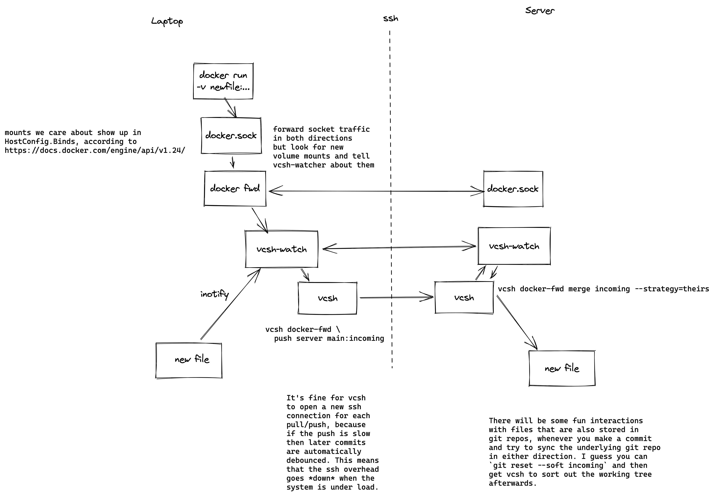

# docker-fwd

`docker-fwd` is intended as an alternative to docker-for-mac. The idea is that you have a docker-fwd daemon that listens on `unix:///var/run/docker.sock` on your laptop, and forwards everything to a remote docker daemon over ssh.

## File Synchronisation

The crucial piece that has stopped people from doing this before is file synchronisation. This is the piece that traps us in the prison that is docker-for-mac.

Even when you're using docker-for-mac, the file syncronisation story is pretty poor. If you have lots of tiny files (like you do in large python/nodejs projects) the round-trip times to the laptop on each file access become quite painful.

To get around this performance problem, people have come up with projects like [docker-sync](https://github.com/EugenMayer/docker-sync). `docker-sync` uses `unison` to provide an eventually-consistent sync between host and guest, and ensures that all file accesses within the docker container happen on a fast ext4 filesystem. I used `docker-sync` on a previous project, and it was okay, but `unison` is not git-aware, so you have to manually configure its exlusion patterns. It would occasionally get stuck, and I have no idea how to debug OCaml.

`docker-fwd`'s solution for file syncing is a daemon called `vsch-watch`.

